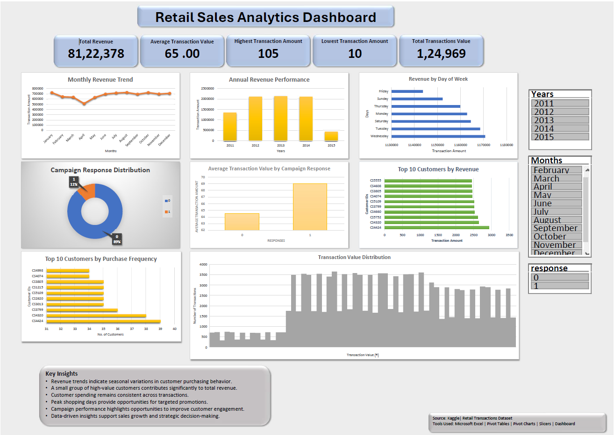

# 🛒 Retail Sales Analytics

## 📌 Project Overview

This project demonstrates an end-to-end retail sales analytics workflow using **Python**, **MySQL**, and **Microsoft Excel**. The project involves cleaning and preprocessing raw retail transaction data, performing business analysis using SQL, and creating an interactive Excel dashboard to visualize key business metrics and trends.

---

# 🎯 Project Objectives

- Clean and preprocess raw retail sales data using Python.
- Perform business analysis using MySQL.
- Identify revenue trends and customer purchasing behavior.
- Analyze marketing campaign effectiveness.
- Develop an interactive Excel dashboard.
- Generate actionable business insights for decision-making.

---

# 🛠️ Tools & Technologies

- Python (Pandas, NumPy, Matplotlib, Seaborn, SciPy)
- MySQL
- Microsoft Excel
- Pivot Tables
- Pivot Charts
- KPI Cards
- Slicers
- GitHub

---

# 📂 Project Workflow

```
Raw Retail Dataset
        │
        ▼
Python
(Data Cleaning & Preprocessing)
        │
        ▼
MySQL
(Business Analysis)
        │
        ▼
Microsoft Excel
(Pivot Tables • Charts • Dashboard)
        │
        ▼
Business Insights & Recommendations
```

---

# 🐍 Python - Data Cleaning & Preprocessing

Python (Pandas, NumPy, Matplotlib, Seaborn, and SciPy) was used to clean, preprocess, validate, and explore the retail sales dataset before importing it into MySQL and Microsoft Excel.

## Data Cleaning & Preprocessing

- Imported multiple raw retail datasets.
- Merged transaction and customer response datasets into a single analytical dataset.
- Inspected dataset structure and summary statistics.
- Removed missing (NULL) values and duplicate records.
- Converted transaction dates into DateTime format.
- Corrected and validated data types.
- Standardized data for consistency.
- Exported the cleaned dataset as `Retail_Data_Cleaned.csv` for SQL analysis and Excel reporting.

---

## Exploratory Data Analysis (EDA)

Performed exploratory data analysis to understand customer purchasing behavior and sales performance.

### Customer Analysis

- Calculated total unique customers.
- Computed total spending by customer.
- Calculated average customer spending.
- Identified top customers based on purchase frequency.

### Sales Analysis

- Identified highest and lowest transaction amounts.
- Analyzed monthly sales trends.
- Compared spending patterns by campaign response.
- Evaluated campaign response distribution.

### Data Validation & Outlier Detection

- Generated descriptive statistics.
- Detected potential outliers using the Z-Score method.
- Validated transaction amount distribution.

### Data Visualization

Created visualizations using Matplotlib and Seaborn:

- Monthly Sales Trend
- Total Spending by Campaign Response
- Transaction Amount Distribution (Box Plot)
- Top Customers by Number of Transactions

---

## Python Libraries Used

- Pandas
- NumPy
- Matplotlib
- Seaborn
- SciPy

### Python Outputs

- `Retail_Data_Cleaning.ipynb`
- `Retail_Data_Cleaning.py`
- `Retail_Data_Cleaned.csv`

---

# 🗄️ SQL - Business Analysis

The cleaned dataset was imported into MySQL to perform business analysis.

### SQL Queries Performed

- Total Revenue
- Total Transactions
- Average Transaction Value
- Highest Transaction Amount
- Lowest Transaction Amount
- Revenue by Year
- Revenue by Month
- Revenue by Day of Week
- Top 10 Customers by Revenue
- Top 10 Customers by Purchase Frequency
- Campaign Response Distribution
- Average Spending by Campaign Response

### Business Questions Answered

- What is the total revenue generated?
- Which customers generate the highest revenue?
- Which customers purchase most frequently?
- How does revenue change over time?
- Which days generate the highest sales?
- How effective was the marketing campaign?

---

# 📈 Excel Dashboard

An interactive dashboard was created using Microsoft Excel.

### KPI Cards

- Total Revenue
- Total Transactions
- Average Transaction Value
- Highest Transaction Amount
- Lowest Transaction Amount

### Visualizations

- Monthly Revenue Trend
- Annual Revenue Performance
- Revenue by Day of Week
- Campaign Response Distribution
- Average Transaction Value by Campaign Response
- Top 10 Customers by Revenue
- Top 10 Customers by Purchase Frequency
- Transaction Value Distribution

### Interactive Filters

- Year
- Month
- Campaign Response

---

# 📊 Key Insights

- Revenue trends reveal seasonal sales patterns.
- High-value customers contribute significantly to overall revenue.
- Customer spending remains consistent across transactions.
- Peak shopping days provide opportunities for targeted promotions.
- Campaign response analysis highlights customer engagement trends.
- Interactive dashboards enable faster business decision-making.

---

# 📁 Project Structure

```
Retail-Sales-Analytics
│
├── Dataset
│   ├── Retail_Data.csv
│   └── Retail_Data_Cleaned.csv
│
├── Python
│   ├── Retail_Data_Cleaning.ipynb
│   ├── Retail_Data_Cleaning.py
│   └── Retail_Data_Cleaned.csv
│
├── SQL
│   └── Retail_Sales_Analysis.sql
│
├── Excel
│   └── Retail_Sales_Analytics_Dashboard.xlsx
│
├── Images
│   └── Dashboard.png
│
├── Report
│   └── Retail_Sales_Analytics_Report.pdf
│
└── README.md
```

---

# 📷 Dashboard Preview

The interactive Microsoft Excel dashboard provides key insights into retail sales performance, customer behavior, and marketing campaign effectiveness.



---

# 🚀 How to Run the Project

1. Clone or download the repository.
2. Run `Retail_Data_Cleaning.py` to generate the cleaned dataset.
3. Import `Retail_Data_Cleaned.csv` into MySQL.
4. Execute `Retail_Sales_Analysis.sql`.
5. Open `Retail_Sales_Analytics_Dashboard.xlsx` to explore the interactive dashboard.1. Review the raw dataset in the **Dataset** folder.
2. Run the Python script to clean and preprocess the data.
3. Import the cleaned CSV into MySQL.
4. Execute the SQL queries to perform business analysis.
5. Open the Excel dashboard to explore interactive visualizations.

---

# 👤 Author

**Vaishnavi**

M.Sc. Microbiology | IBM Certified in Data Analytics Fundamentals & Data Visualization

Aspiring Data Analyst skilled in Python, SQL, Excel, and Tableau with hands-on experience in data cleaning, analysis, and dashboard development.

---

# 📜 License

This project is shared for educational and portfolio purposes.
